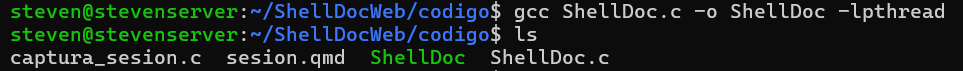
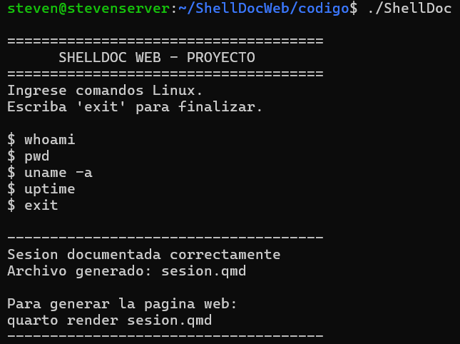
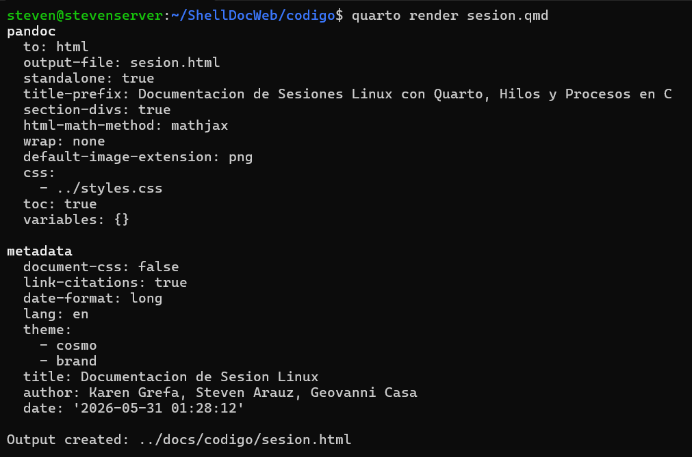
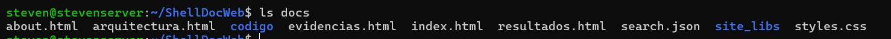
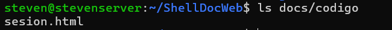

# Evidencias del Proyecto

## Comandos Ejecutados Durante la Demostración

Durante la prueba del sistema se ejecutaron los siguientes comandos Linux:

```bash
whoami
pwd
uname -a
uptime
df -h
free -h
ls -la
ps aux
```

## Información Capturada

El sistema registró automáticamente:

- Usuario activo (`whoami`)
- Directorio de trabajo (`pwd`)
- Información del sistema operativo (`uname -a`)
- Tiempo de actividad del sistema (`uptime`)
- Espacio disponible en disco (`df -h`)
- Uso de memoria RAM y swap (`free -h`)
- Archivos del directorio (`ls -la`)
- Procesos activos (`ps aux`)

## Resultado de la Demostración

La sesión generada registró correctamente:

- 8 comandos ejecutados.
- Fecha y hora de cada ejecución.
- Salida completa de cada comando.
- Resumen final de la sesión.

Posteriormente, el sistema generó automáticamente el archivo `sesion.qmd` y su correspondiente página web `sesion.html`.

# Evidencias Visuales

## Compilación del Proyecto



## Ejecución del Sistema



## Generación del Documento HTML



## Sitio Web Generado



